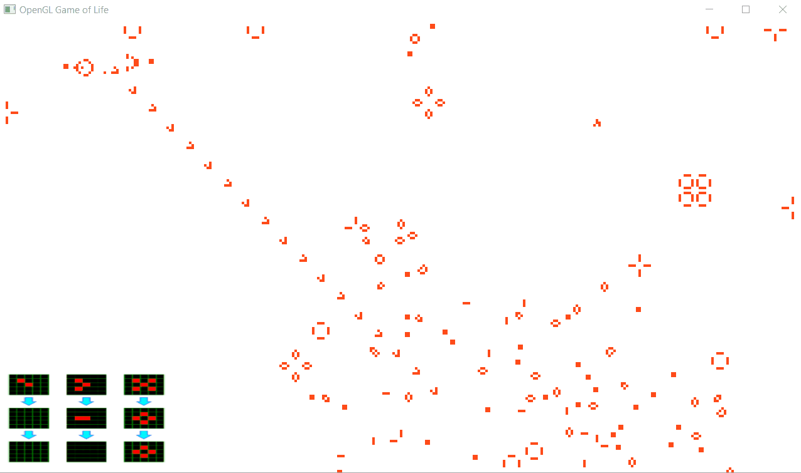

# The Game of Life in OpenGL using GLSL shaders

Simulates John Conway's "The Game of Life" in an OpenGL fragment shader (GLSL). 



## How it works
 * Application reads an image with the initial pattern
 * Two render passes
 * First pass renders the new state of the simulation into a framebuffer, using the previous framebuffer output as input
   * Fragment shader samples points around current pixel and writes new state to attached color buffer
 * Then the two framebuffers are swapped
 * Second pass just renders the output texture as fullscreen quad on screen buffer

## Building on Linux
Install GCC or Clang, along with cmake and make. On most Linux distibutions this is a straightforward and well documented task.

```
mkdir Build && cd Build
cmake ..
make
```

## Building on Windows
This can be build using Visual Studio, but this will show how you can setup the MinGW GCC compiler on windows to build cross platform C++ applications.

### Setup MinGW/x64 on Windows
Download and install MSYS2:
http://www.msys2.org/

Here is a guide which covers most of this:
https://www.devdungeon.com/content/install-gcc-compiler-windows-msys2-cc

Now install required dependencies:
```
pacman -Syu
pacman -S mingw-w64-x86_64-toolchain
pacman -S mingw-w64-x86_64-make
pacman -S mingw-w64-x86_64-cmake
pacman -S mingw-w64-x86_64-glfw
pacman -S mingw-w64-x86_64-glew
pacman -S mingw-w64-x86_64-glm
pacman -S mingw-w64-x86_64-libpng
pacman -Ss glfw
```

Add to PATH: ```C:\msys64\mingw64\bin```

Then build the source:
```
mkdir Build && cd Build
cmake -G "MinGW Makefiles" ..
mingw32-make
```
